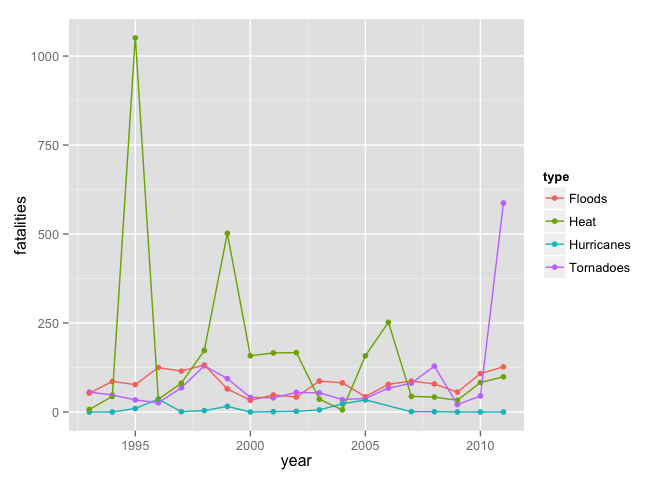
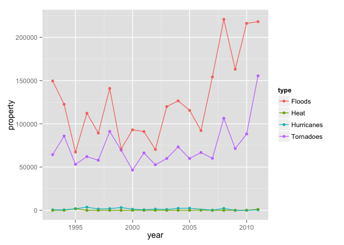

# Extreme Weather Events

# Summary

Data from the US National Weather Service on extreme weather events, indicate
how different broad categories of weather differ in their impact with respect 
to loss of human life or loss of property.

## Data Processing

The NOAA bz2 compressed csv formatted data set includes data from 1950 through 2011. 
However the categories were useful for the period from 1993 through 2011.


```r
library(dplyr)
library(lubridate)
library(tidyr)
library(ggplot2)
```


```r
# storm.data <- tbl_df(
#   read.csv(file = "data//StormData.csv", header = TRUE, #nrows = 1000,
#            colClasses = c(
#              "NULL", 
#              "character", #date
#              rep("NULL", times = 4),
#              "factor", #state
#              "factor", #type
#              rep("NULL", times = 14),
#              "numeric", #fatal
#              "numeric", #inju
#              "numeric", #property
#              rep("NULL", times = 12)
#           )
#   )
# )
# 
# 
# saveRDS(object = storm.data, ascii = FALSE, compress = "bzip2", file = "data//stormdata.rds")

storm.data <- readRDS(file = "data//stormdata.rds") # cached representation of the data
```


```r
storm.data2 <- storm.data %>% 
  transmute(
    date = lubridate::mdy(
      x = sub(x = BGN_DATE, pattern = "([0-9/]+).*", replacement = "\\1")),
    year = year(date),
    EVTYPE, FATALITIES, INJURIES, PROPDMG
)
```

# Overview

This analysis focuses on extreme weather events from 1993 through 2011,
corresponding with broad categories: tornadoes, hurricanes, floods, and heat.


```r
impact <- storm.data2 %>%
  filter(year >= 1993) %>%
  group_by(EVTYPE, year) %>%
  summarise(
    fatalities = sum(FATALITIES), 
    property = sum(PROPDMG), 
    count = n()
    ) %>%
  mutate(
    torn = grepl(pattern = "TORN", x = EVTYPE),
    hurr = grepl(pattern = "HURR|TYPH", x = EVTYPE),
    floo = grepl(pattern = "FLOO", x = EVTYPE),
    heat = grepl(pattern = "HEAT", x = EVTYPE)
)

#overlap of categories?
# range(impact$torn + impact$hurr + impact$floo + impact$heat) is [0, 1]

impact.all <- rbind(
  impact %>%
    filter(torn) %>%
    group_by(year) %>%
    summarise(fatalities = sum(fatalities), 
              property = sum(property)) %>%
    mutate(type = "Tornadoes")
  ,
  impact %>%
    filter(hurr) %>%
    group_by(year) %>%
    summarise(fatalities = sum(fatalities), 
              property = sum(property)) %>%
    mutate(type = "Hurricanes")
  ,
  impact %>%
    filter(floo) %>%
    group_by(year) %>%
    summarise(fatalities = sum(fatalities), 
              property = sum(property)) %>%
    mutate(type = "Floods")
  ,
  impact %>%
    filter(heat) %>%
    group_by(year) %>%
    summarise(fatalities = sum(fatalities), 
              property = sum(property)) %>%
    mutate(type = "Heat")
  )
```

### According to the reported data, how the cost to human life of the different 
types of storms compare:


```r
ggplot(data = impact.all) + 
  aes(x = year, y = fatalities) + 
  geom_point(mapping = aes(group = type, color = type)) + 
  geom_line(aes(color = type))
```

 

### According to the reported data, how the property damage of the different 
types of storms compare:


```r
ggplot(data = impact.all) + 
  aes(x = year, y = property) + 
  geom_point(mapping = aes(group = type, color = type)) + 
  geom_line(aes(color = type))
```

 

## Conclusion

According to the data hurricanes tend to result in fewer deaths than the other
three types. Despite their prominence in the news they are rarer events than
fatal heat waves, or deaths from flooding and tornadoes.

While heat events are notable for the number of deaths, they result in little 
property damage. However, floods cause significant property damage, as do tornadoes.
